# Diagrams Created With Cursor

I'll analyze the backend and frontend code to understand the high-level flow and create meaningful mermaid diagrams. Let me start by exploring the codebase structure and understanding the key components.

Now let me examine the backend interface definition to understand the complete API:

Based on my analysis of the codebase, I'll create comprehensive mermaid diagrams showing the high-level flow of the encrypted chat system. The system uses vetKeys for cryptographic operations and has a sophisticated key management system with ratcheting and resharing capabilities.

## Backend Architecture & Flow

### 1. Chat Creation & Key Management Flow

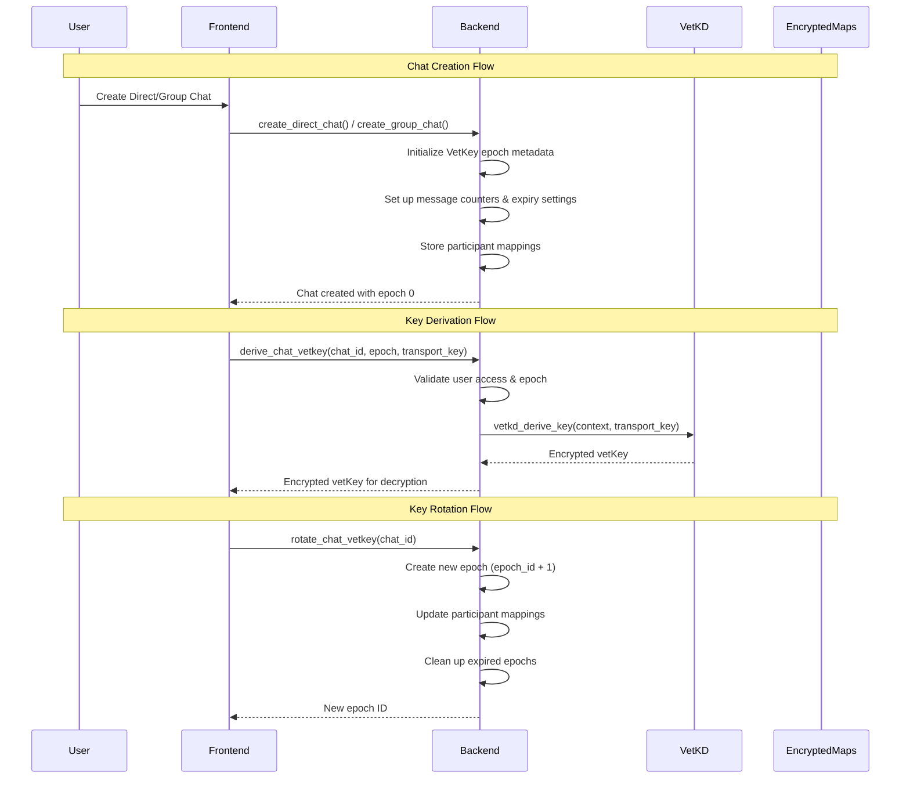

### 2. Message Encryption & Decryption Flow

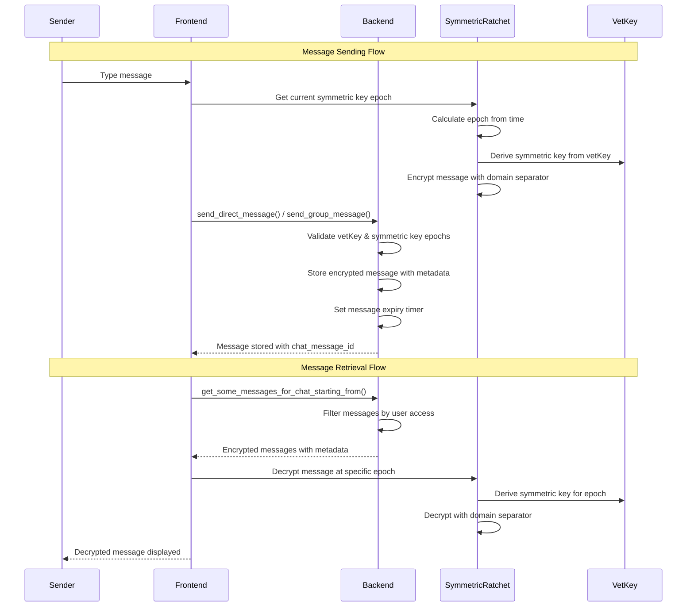

### 3. Key Caching & Resharing Flow

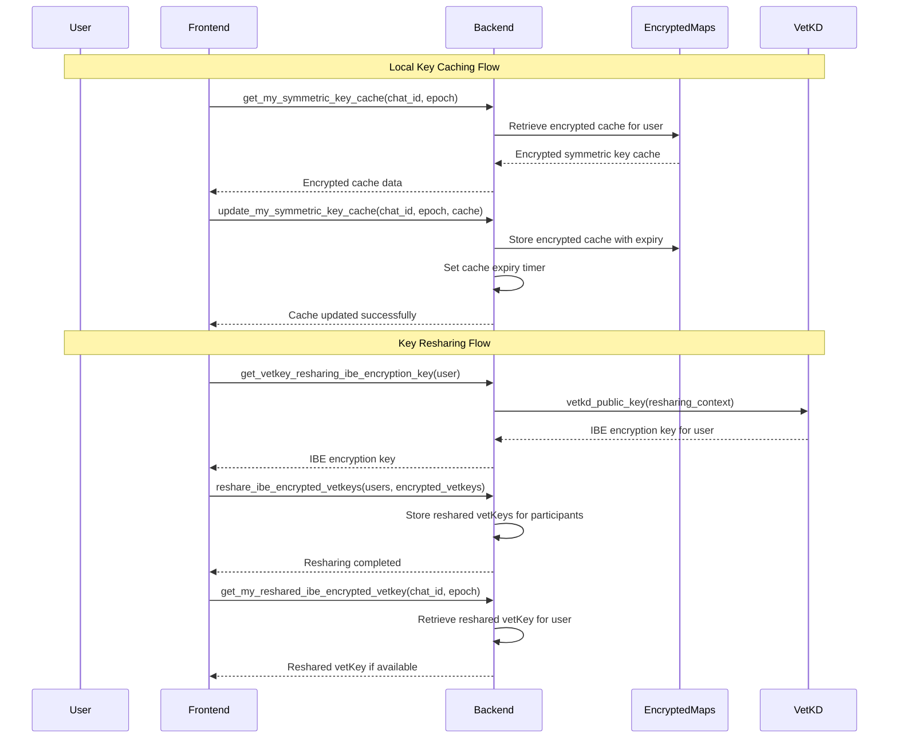

## Frontend Architecture & Flow

### 4. Frontend Service Architecture

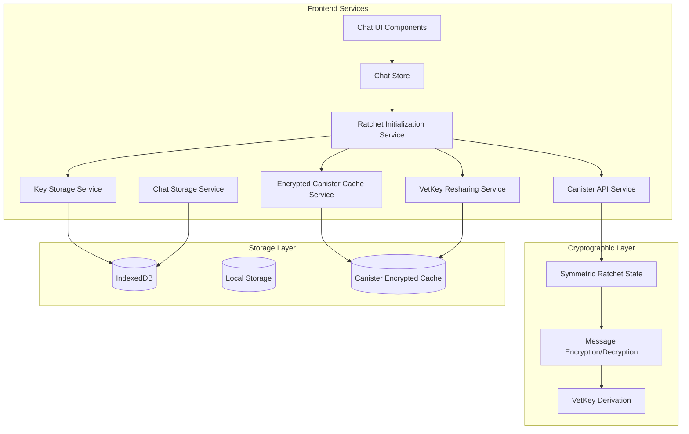

### 5. Frontend Key Initialization Flow

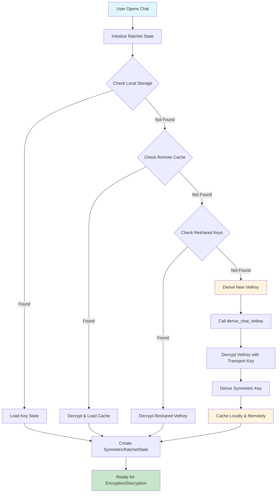

### 6. Message Lifecycle Flow

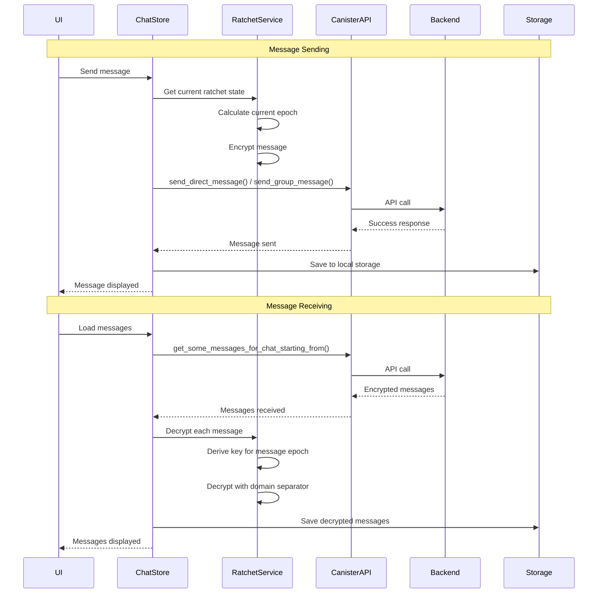

## Key Cryptographic Concepts

### 7. VetKey & Symmetric Key Hierarchy

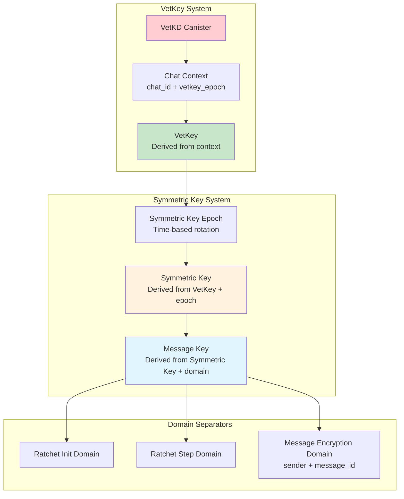

These diagrams show the comprehensive flow of the encrypted chat system, highlighting:

1. **Backend Flow**: Chat creation, key management, message handling, and cryptographic operations
2. **Frontend Flow**: Service architecture, key initialization, and message lifecycle
3. **Cryptographic Flow**: How vetKeys, symmetric keys, and message keys are derived and used
4. **Key Management**: Caching, resharing, and rotation mechanisms
5. **Security Features**: Epoch-based key rotation, message expiry, and access control

The system uses a sophisticated multi-layered approach where vetKeys provide the foundation for deriving symmetric keys, which are then used for message encryption/decryption with time-based rotation and resharing capabilities.

## Class Diagrams for Encrypted Messaging Service

### 1. Core Service Architecture & Relationships

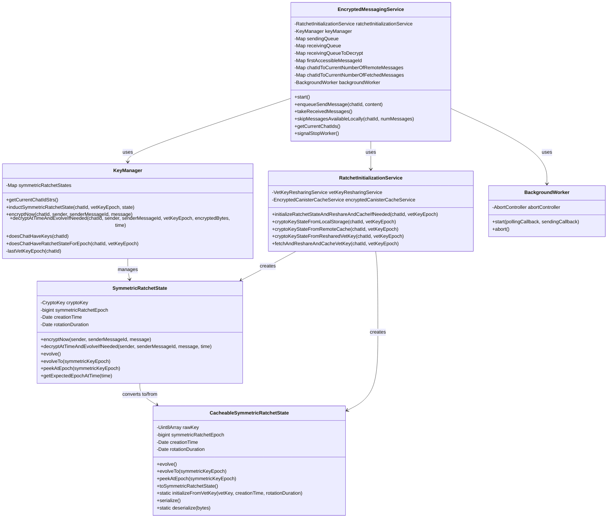

### 2. Key Management & Storage Services

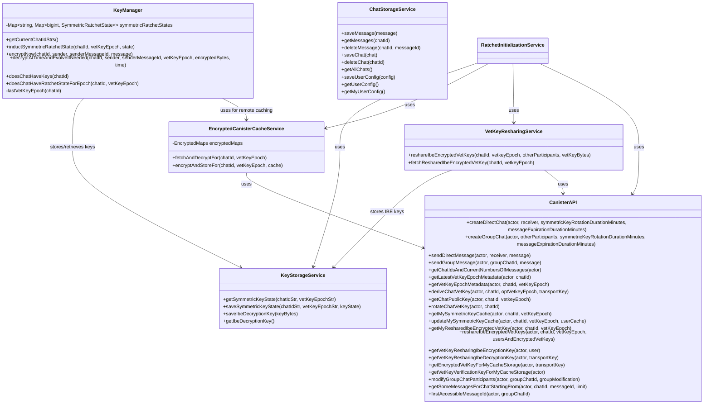

### 3. State Management & UI Integration

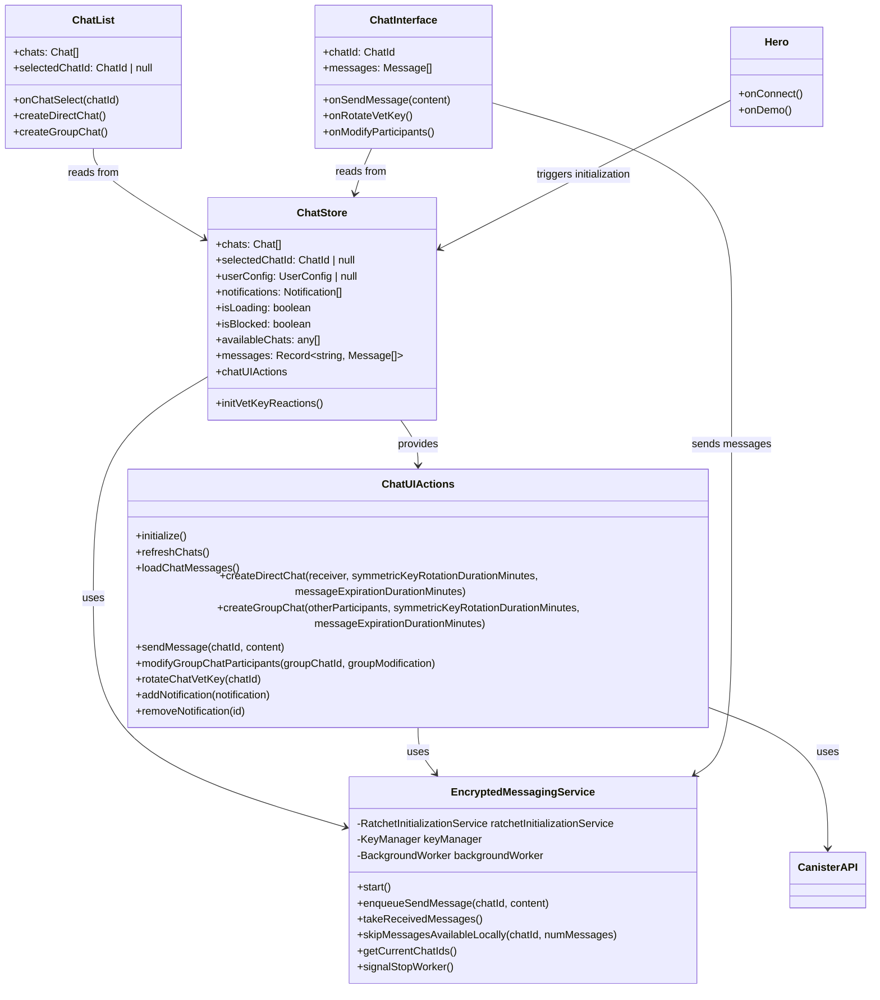

### 4. Cryptographic Service Dependencies

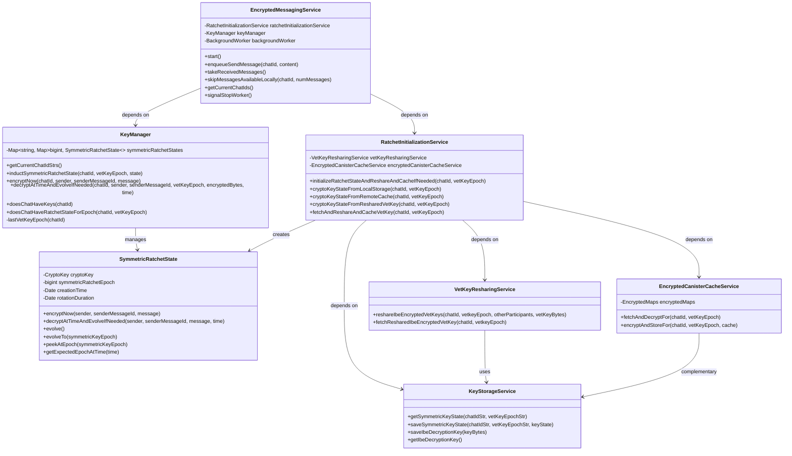

### 5. Message Flow & Queue Management

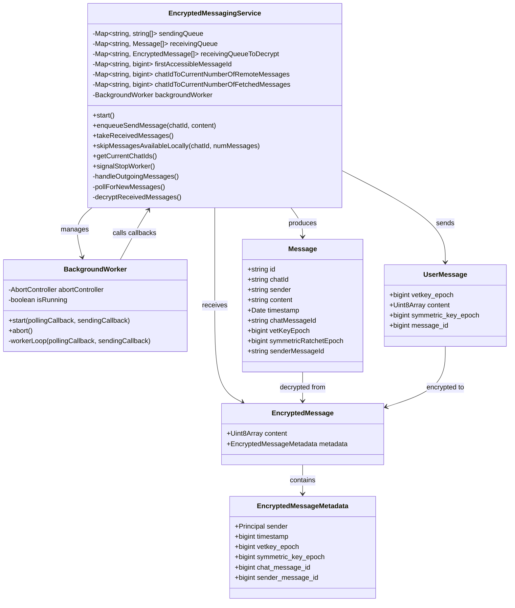

### 6. Key Lifecycle Management

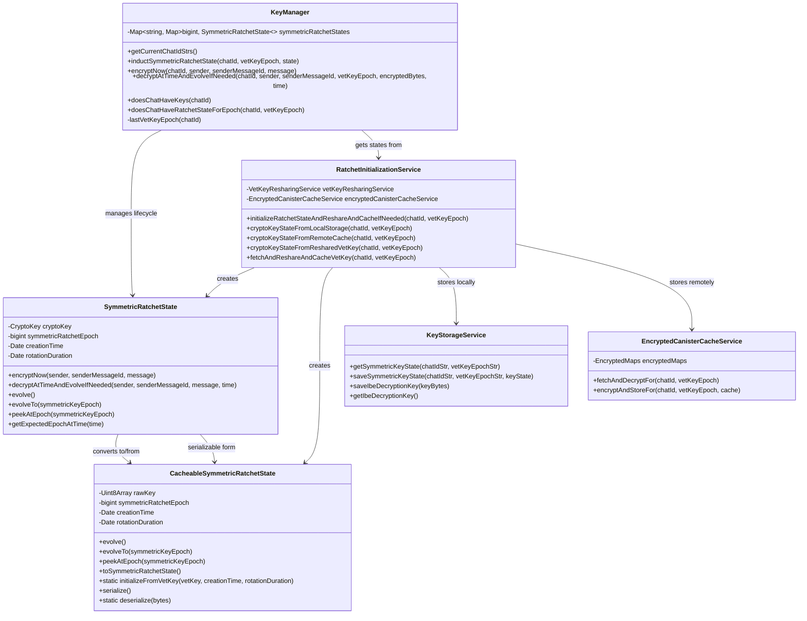

These class diagrams show:

1. **Core Service Architecture**: How `EncryptedMessagingService` orchestrates the entire system using `KeyManager` and `RatchetInitializationService`

2. **Key Management & Storage**: The relationship between different storage services (`KeyStorageService`, `EncryptedCanisterCacheService`) and how they work with the `KeyManager`

3. **State Management & UI Integration**: How the chat store integrates with the encrypted messaging service and UI components

4. **Cryptographic Service Dependencies**: The dependency hierarchy and how cryptographic services interact

5. **Message Flow & Queue Management**: How messages flow through the system using queues and background workers

6. **Key Lifecycle Management**: The complete lifecycle of cryptographic keys from creation to storage to usage

The `KeyManager` is central to the system, managing the lifecycle of `SymmetricRatchetState` objects and coordinating with various storage and initialization services to ensure keys are available when needed for encryption/decryption operations.
